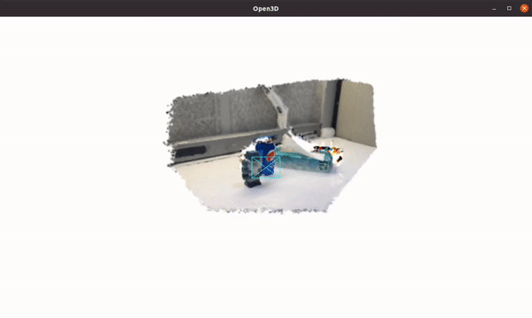
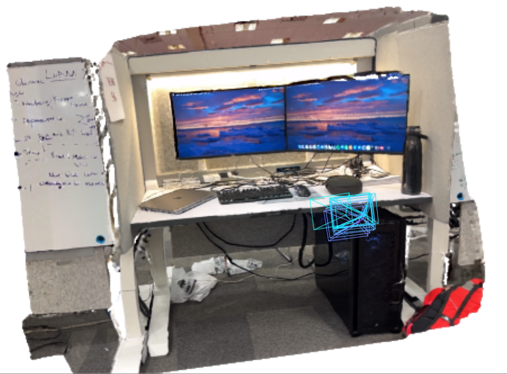

<!-- PROJECT LOGO -->

<p align="center">

  <h1 align="center">SplaTAM: Splat, Track & Map 3D Gaussians for Dense RGB-D SLAM</h1>
  <p align="center">
    <a href="https://nik-v9.github.io/"><strong>Nikhil Keetha</strong></a>
    ·
    <a href="https://jaykarhade.github.io/"><strong>Jay Karhade</strong></a>
    ·
    <a href="https://krrish94.github.io/"><strong>Krishna Murthy Jatavallabhula</strong></a>
    ·
    <a href="https://gengshan-y.github.io/"><strong>Gengshan Yang</strong></a>
    ·
    <a href="https://theairlab.org/team/sebastian/"><strong>Sebastian Scherer</strong></a>
    <br>
    <a href="https://www.cs.cmu.edu/~deva/"><strong>Deva Ramanan</strong></a>
    ·
    <a href="https://www.vision.rwth-aachen.de/person/216/"><strong>Jonathon Luiten</strong></a>
  </p>
  <h3 align="center"><a href="">Paper</a> | <a href="">Video</a> | <a href="https://spla-tam.github.io/">Project Page</a></h3>
  <div align="center"></div>
</p>

<p align="center">
  <a href="">
    
  </a>
</p>

<br>

<!-- TABLE OF CONTENTS -->
<details open="open" style='padding: 10px; border-radius:5px 30px 30px 5px; border-style: solid; border-width: 1px;'>
  <summary>Table of Contents</summary>
  <ol>
    <li>
      <a href="#installation">Installation</a>
    </li>
    <li>
      <a href="#downloads">Downloads</a>
    </li>
    <li>
      <a href="#demo">Online Demo</a>
    </li>
    <li>
      <a href="#run">Run</a>
    </li>
    <!-- <li>
      <a href="#evaluation">Evaluation</a>
    </li> -->
    <li>
      <a href="#acknowledgement">Acknowledgement</a>
    </li>
    <li>
      <a href="#citation">Citation</a>
    </li>
    <li>
      <a href="#contact">Contact</a>
    </li>
  </ol>
</details>


## Installation

First, you have to make sure that you have all dependencies in place.
The simplest way is to use [anaconda](https://www.anaconda.com/). 

You can create an anaconda environment called `splatam`.
```bash
conda env create -f environment.yml
conda activate splatam
```
## Demo

You can SplaTAM your own environment with an iPhone or LiDAR-equipped Apple device by downloading and using <a href="https://apps.apple.com/au/app/nerfcapture/id6446518379">Nerf-capture</a>.

Make sure that your iPhone and PC are connected to the same WiFi network, and then run the following command:

 ```bash
bash bash_scripts/online_demo.bash configs/iphone/online_demo.py
```

On the app, keep clicking send for successive frames, and watch SplaTAM's reconstruction visualizations! Here's a cool example result!

<p align="center">
  <a href="">
    
  </a>
</p>

You can also run offline optimization for your iPhone captures by first capturing a dataset with the following command:

```bash
bash bash_scripts/nerfcapture2dataset.bash
```

Then, perform slam with the following command:

```bash
bash bash_scripts/nerfcapture.bash configs/iphone/nerfcapture.py
```

## Downloads

### Replica
Download the data as below, and the data is saved into the `./datasets/Replica` folder. Note that the Replica data is generated by the authors of iMAP (but hosted by the authors of NICE-SLAM). Please cite iMAP if you use the data.
```bash
bash bash_scripts/download_replica.sh
```

### TUM-RGBD
```bash
bash bash_scripts/download_tum.sh
```
DATAROOT is `./data` by default. Please change the `input_folder` path in the scene-specific config files if stored somewhere else on your machine.


### ScanNet
Please follow the data downloading procedure on the [ScanNet](http://www.scan-net.org/) website, and extract color/depth frames from the `.sens` file using this [code](https://github.com/ScanNet/ScanNet/blob/master/SensReader/python/reader.py).

<details>
  <summary>[Directory structure of ScanNet (click to expand)]</summary>
  
  DATAROOT is `./datasets` by default. If a sequence (`sceneXXXX_XX`) is stored in other places, please change the `input_folder` path in the config file or in the command line.

```
  DATAROOT
  └── scannet
        └── scene0000_00
            └── frames
                ├── color
                │   ├── 0.jpg
                │   ├── 1.jpg
                │   ├── ...
                │   └── ...
                ├── depth
                │   ├── 0.png
                │   ├── 1.png
                │   ├── ...
                │   └── ...
                ├── intrinsic
                └── pose
                    ├── 0.txt
                    ├── 1.txt
                    ├── ...
                    └── ...
```
</details>


We use the following sequences: 
```
scene0000_00
scene0059_00
scene0106_00
scene0181_00
scene0207_00
```

### ScanNet++
Please follow the data downloading and image undistortion procedure on the <a href="https://kaldir.vc.in.tum.de/scannetpp/">ScanNet++</a> website. We use the following sequences: 

```
8b5caf3398
b20a261fdf
```

For b20a261fdf, we use the first 360 frames.

### Replica-V2
We use the Replica-V2 to evaluate novel view synthesis, we use the pre-generated replica sequences from <a href="https://github.com/kxhit/vMAP">vMAP</a>.

## Run

For running SplaTAM, we recommend using [weights and biases](https://wandb.ai/) for the logging. This can be turned on by setting the `wandb` flag to True in the configs file. Also make sure to specify the path `wandb_folder`. If you don't have a wandb account, first create one. Each scene has a config folder, where the `input_folder` and `output` paths need to be specified. Below, we show some example run commands for one scene from each dataset.

### Replica
To run SplaTAM on the `room0` scene, run the following command. 
```bash
python scripts/slam.py configs/Replica/slam.py
```
After reconstruction, the trajectory error will be evaluated along with the rendering metrics.
For other scenes, modify the configs/Replica/slam.py file.

### TUM-RGBD
To run SplaTAM on the `freiburg1_desk` scene, run the following command. 
```bash
python run.py configs/TUM_RGBD/slam.py
```
After reconstruction, the trajectory error will be evaluated along with the rendering metrics.
For other scenes, modify the configs/TUM_RGBD/slam.py file.

### ScanNet
To run SplaTAM on the `scene0000_00` scene, run the following command. 
```bash
python run.py configs/ScanNet/slam.py
```
After reconstruction, the trajectory error will be evaluated along with the rendering metrics.
For other scenes, modify the configs/ScanNet/slam.py file.


## Acknowledgement

We thank the authors of the following repositories for their open-source code:

- 3D Gaussians
  - [Dynamic 3D Gaussians](https://github.com/JonathonLuiten/Dynamic3DGaussians)
  - [3D Gaussian Splating](https://github.com/graphdeco-inria/gaussian-splatting)
- Dataloaders
  - [GradSLAM & ConceptFusion](https://github.com/gradslam/gradslam/tree/conceptfusion)
- Baselines
  - [Nice-SLAM](https://github.com/cvg/nice-slam)
  - [Point-SLAM](https://github.com/eriksandstroem/Point-SLAM)

## Citation
If you find our paper and code useful, please cite it as:

```bib
@article{keetha2023splatam,
    author    = {Keetha, Nikhil and Karhade, Jay and Jatavallabhula, Krishna Murthy and Yang, Gengshan and Scherer, Sebastian and Ramanan, Deva and Luiten, Jonathan}
    title     = {SplaTAM: Splat, Track & Map 3D Gaussians for Dense RGB-D SLAM},
    journal   = {arXiv},
    year      = {2023},
}
```

## Developers
- [Nik-V9](https://github.com/Nik-V9) ([Nikhil Keetha](https://nik-v9.github.io/))
- [JayKarhade](https://github.com/JayKarhade) ([Jay Karhade](https://jaykarhade.github.io/))
- [JonathonLuiten](https://github.com/JonathonLuiten) ([Jonathan Luiten](https://www.vision.rwth-aachen.de/person/216/))
- [krrish94](https://github.com/krrish94) ([Krishna Murthy Jatavallabhula](https://krrish94.github.io/))
- [gengshan-y](https://github.com/gengshan-y) ([Gengshan Yang](https://gengshan-y.github.io/))
